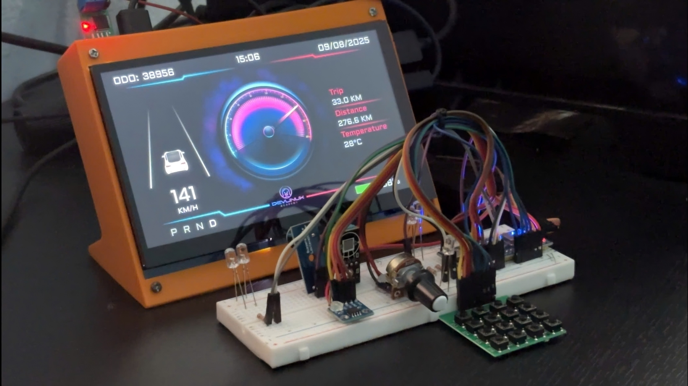

# Building a Vehicle Control Unit (VCU) with Digital Instrument Cluster for Electric Vehicles

A simulated automotive system featuring a **Digital Instrument Cluster (IPC)** and **Vehicle Control Unit (VCU)** for electric vehicles, built on Raspberry Pi and STM32 with CAN bus communication. The VCU centrally manages vehicle states and I/O configurations, while ECU nodes (STM32-based) run identical firmware for scalability and flexibility. This project demonstrates a zonal E/E architecture, HMI design adhering to ISO 2575 and ISO 26262 principles, and CAN networking for real-time data exchange.

## Key Features

- **Digital HMI**: Qt/QML-based interface displaying speed, battery level, odometer, trip distance, external temperature, gear position (P/R/N/D), and tell-tales (e.g., turn signals, high/low beam, hazard lights) compliant with ISO 2575.
- **Vehicle State Management**: VCU handles states like Off, Charging, and Driving, processing data from simulated ECUs.
- **CAN Bus Communication**: Structured CAN protocol (29-bit IDs) for reliable data exchange between VCU (Raspberry Pi) and ECU nodes (STM32), supporting up to 64 digital inputs/outputs and 32 analog inputs per ECU.
- **Dynamic I/O Configuration**: Flexible I/O mapping via JSON files, allowing runtime reconfiguration without code changes (e.g., mapping inputs like turn signals to outputs like LEDs).
- **Real-Time Processing**: Low-latency data handling with ADC reading via DMA, FIFO queues for CAN frames, and signal-slot mechanisms in Qt.
- **Scalability**: Zonal architecture supporting multiple ECU nodes; tested for stability under varying bus loads.
- **Algorithms**: Battery percentage calculation based on energy consumption; Distance-to-Empty (DTE) estimation blending short-term and long-term consumption data.

## System Requirements

### Hardware

- Raspberry Pi 5 (4GB RAM, 4-core 2.4GHz CPU)
- STM32F103C8 (ARM Cortex-M3, 72MHz, with CAN transceiver SN65HVD230)
- USB to CAN adapter (e.g., Makerbase CANable v1.0) for Raspberry Pi
- Waveshare 7-inch HDMI Capacitive Touch Screen LCD (1024×600) for IPC
- Inputs: Potentiometer (speed simulation), temperature sensor, switches/buttons (turn signals, beams, hazard, gear)
- Outputs: LEDs (lights, indicators), buzzer

### Software

- Linux OS (custom Yocto image recommended)
- Qt 5 with Qt Creator for HMI development
- STM32CubeIDE for ECU firmware
- SocketCAN for Linux CAN communication
- GCC cross-compiler for ARM
- Yocto Project for building custom Raspberry Pi images

## Installation

1. **Clone the repository**:

   ```bash
   git clone https://github.com/Tdieney/VCU_Cluster_System.git
   cd VCU_Cluster_System
   ```

2. **Set up Raspberry Pi 5 (VCU)**:  
   Follow [Build image for Raspberry Pi 5](docs/yocto/1.%20Build%20image%20for%20Raspberry%20Pi%205.md) to create a Yocto-based Linux image with Qt and SocketCAN support.

3. **Set up STM32 (ECU Nodes)**:  
   See [ECU Nodes](ecu_nodes/README.md) for firmware flashing, CubeMX configuration (CAN at 1Mbps, GPIO mappings), and hardware wiring.

4. **Build VCU Software**:  
   See [VCU software overview](software/README.md) for building the Qt application, including CAN handler integration and JSON config loading.

5. **3D Printed Case**:  
   Refer to [hardware/README.md](hardware/README.md) for 3D-printed case STL files, wiring diagrams, and setup images (e.g., CAN bus connections with 120 Ohm resistors).

## Usage

- Flash and power up the STM32 ECU nodes; connect via CAN bus.
- Attach sensors and outputs as per the pin mappings in [ecu_nodes/README.md](ecu_nodes/README.md).
- Launch the system: The HMI will display real-time data (e.g., speed from potentiometer via CAN). Interact via switches to toggle lights and observe UI updates.
- Configure I/O: Edit `io_configs/io_config.json` for custom mappings (e.g., assign "turn_left_switch" to a new index) and reload the VCU app.
- Monitor CAN traffic: Use tools like `candump` or PCAN-View for debugging.

Demo Video: [Google Drive Link](https://drive.google.com/file/d/1FQPo_EUh4a_-FMsMQpHUV6WIgGDGTdTw/view?usp=sharing)

## Workspace Structure

```
.
├── .gitignore
├── README.md
├── report_PoC.docx
├── .vscode/
│   └── settings.json
├── docs/
│   ├── report_vn/
│   │   ├── Report.docx
│   │   └── Report.pptx
│   └── yocto/
│       ├── 1. Build image for Raspberry Pi 5.md
│       ├── 2. CAN Communication.md
│       ├── 3. Systemd startup script.md
│       ├── 4. Integrating Qt into a Yocto Project.md
│       └── 5. Auto-launch Qt application.md
├── ecu_nodes/
│   ├── README.md
│   ├── .metadata/
│   ├── img/
│   └── stm32f1_ecu_nodes/
├── hardware/
│   ├── Case_for_7inch_display_and_Pi5.stl
│   ├── README.md
│   └── img/
├── software/
│   ├── README.md
│   ├── qtapp/
│   └── screenshots/
```

## Illustration

<p align="center">
  
  
</p>

## Reports

- [Detailed Project Report](docs/report_vn/Report.docx)
- [Project Presentation](docs/report_vn/Report.pptx)

## Development & Documentation

- [ECU Nodes](ecu_nodes/README.md)
- [Hardware Setup](hardware/README.md)
- [VCU Software Overview](software/README.md)
- [Build image for Raspberry Pi 5](docs/yocto/1.%20Build%20image%20for%20Raspberry%20Pi%205.md)
- [CAN Communication](docs/yocto/2.%20CAN%20Communication.md)
- [Systemd Startup Script](docs/yocto/3.%20Systemd%20startup%20script.md)
- [Integrating Qt into a Yocto Project](docs/yocto/4.%20Integrating%20Qt%20into%20a%20Yocto%20Project.md)
- [Auto-launch Qt Application](docs/yocto/5.%20Auto-launch%20Qt%20application.md)

## Contributing

1. Fork the repository.
2. Create a feature branch.
3. Commit changes.
4. Push and open a pull request.

## References

- ISO 26262: Road vehicles – Functional safety (2018)
- ISO 2575: Road vehicles – Symbols for controls, indicators and tell-tales (2024)
- Qt Documentation: [doc.qt.io](https://doc.qt.io)
- SocketCAN Documentation: [docs.kernel.org/networking/can.html](https://docs.kernel.org/networking/can.html)
- Yocto Project Documentation: [docs.yoctoproject.org](https://docs.yoctoproject.org)
- STM32 Reference Manual (RM0008): STMicroelectronics (2018)
- CAN Protocol Tutorial: [controllerstech.com/can-protocol-in-stm32](https://controllerstech.com/can-protocol-in-stm32/)
- Zonal Architecture Overview: Molex Technical Article (2022)

## Contact

For issues or inquiries, open a GitHub issue or contact [vanthinh.nguyentran.4@gmail.com].