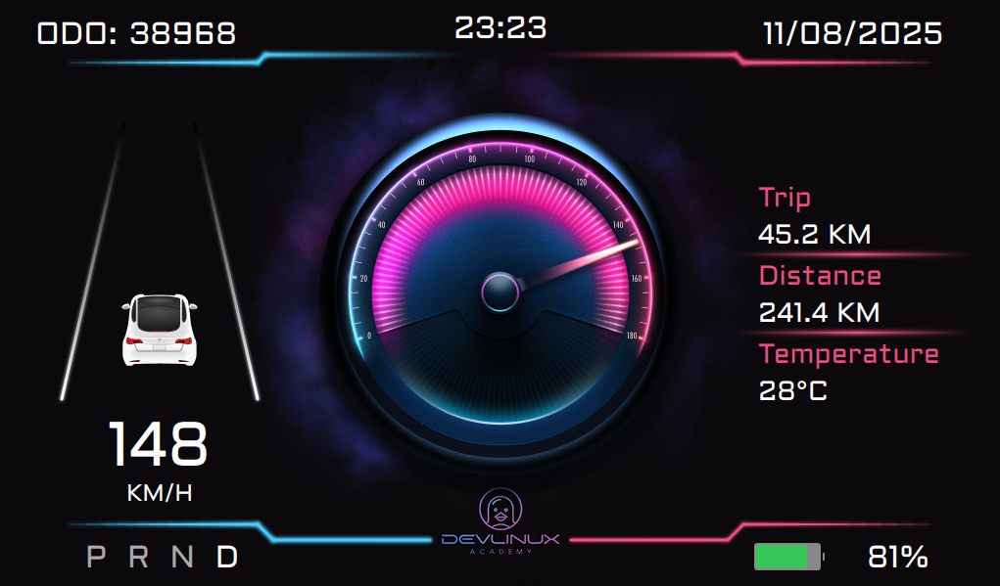

# QtApp - Instrument Cluster

## Overview

This is a Qt Quick-based instrument cluster application designed for embedded automotive systems. It features a graphical dashboard with real-time vehicle data, CAN bus communication, and a modern UI. The project is structured for easy integration with Yocto-based embedded Linux systems.

<p align="center">
    
</p>

## Features

- **Instrument Cluster UI**: Speedometer, trip meter, battery, DTE, temperature, gear, and indicator lights.
- **CAN Bus Communication**: Receives and transmits vehicle signals using Linux SocketCAN.
- **Configurable IO Mapping**: Digital and analog IOs are mapped via a JSON configuration file.
- **Resource Management**: All QML, fonts, images, and configs are managed via Qt resource files.
- **Smooth Data Handling**: Analog values are smoothed using a buffer for stable UI updates.

## Directory Structure

```
.
├── main.cpp
├── main.qml
├── qtapp.pro
├── communication/
│   ├── canhandler.cpp
│   └── canhandler.h
├── fonts/
│   └── Aldrich-Regular.ttf
├── images/
│   ├── arrow.png
│   ├── background.png
│   ├── centre.png
│   ├── hazard.png
│   ├── high_beam.png
│   ├── left_arrow.png
│   ├── low_beam.png
│   ├── parking_lights.png
│   └── right_arrow.png
├── io_configs/
│   └── io_config.json            # Configuration file for I/O pins
├── *.qrc (Qt resource files)
```

## Build Instructions

### Prerequisites

- Qt 5 (with Qt Quick, Qt Quick Controls 2, Qt Graphical Effects)
- C++17 compiler
- Linux with SocketCAN support (for CAN features)

### Build with Qt Creator

1. Open `qtapp.pro` in Qt Creator.
2. Configure a kit with the appropriate Qt version and toolchain.
3. Build and run the project.

### Build from Command Line

```sh
qmake
make
./qtapp
```

### Yocto Integration

Please refer to this documentation for Yocto integration: [Bring up Qt UI](4.%20Bring%20up%20Qt%20UI.md)
## Configuration

- **IO Mapping**: Edit `io_configs/io_config.json` to map signals to specific positions.
- **Images/Fonts**: Add or replace files in the `images/` and `fonts/` directories as needed.
- **QML UI**: Modify `main.qml` for UI customization.

## Usage

- The application displays real-time vehicle data and responds to CAN bus signals.
- Indicator lights and gauges update automatically based on CAN input.
- The UI is optimized for 1024x600 displays but can be adjusted in `main.qml`.

---

**Author:** Tdieney
